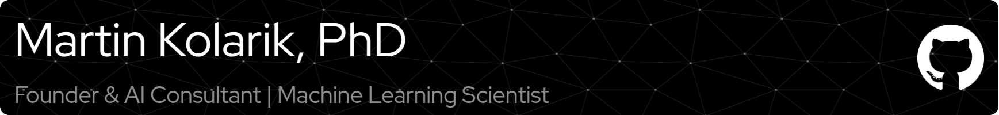

<!--
  When you commit this file to mrkolarik/mrkolarik,
  GitHub will render it on your profile page.
-->

  

<h1 align="center">
  👋 Hi, I’m <strong>Martin Kolarik, Ph.D.</strong>
</h1>

  <em>Founder &amp; AI Consultant | Machine Learning Scientist</em>

  <a href="https://martinkolarik.com">🌐 martinkolarik.com</a> •
  <a href="https://github.com/mrkolarik">🐙 GitHub</a> •
  <a href="https://www.linkedin.com/in/mrkolarik/">🔗 LinkedIn</a> •
  <a href="mailto:martinkolarikemail@gmail.com">✉️ Email</a>

---

## 🚀 What I Do

- Build **deep-tech AI systems**: from research prototypes to production-ready products  
- Lead **3D imaging** & **embedded AI** projects in medical, industrial & cloud environments  
- Drive **ROI**: raised €400 k+ in R&D funding, shipped 3+ products, scaled to 100 k+ deployments  

---

## 🔥 Featured Repositories

  <!-- manually list or use shields for pinned repos -->
  <a href="https://github.com/mrkolarik/3D-brain-segmentation">3D-brain-segmentation</a> •
  <a href="https://github.com/mrkolarik/transfer2d3d">transfer2d3d</a> •
  <a href="https://github.com/mrkolarik/nerudai">nerudai</a>

---

## 📊 GitHub Stats

  
  

---

## 🛠️ Skills

- **ML &amp; CV:** 2D/3D segmentation · transfer learning · NLP · full AI lifecycle  
- **Software:** Python · Java · TensorFlow · PyTorch · Docker · Kubernetes · Linux · Git  
- **Embedded AI &amp; Edge:** HW lifecycle management · expert coordination · edge deployment  
- **Leadership:** team building · mentoring · stakeholder communication · strategic roadmapping  

---

## 📫 Get in Touch

Feel free to drop me a line via email or connect on LinkedIn. Let’s build something great!  
✉️ <a href="mailto:martinkolarikemail@gmail.com">martinkolarikemail@gmail.com</a>  

<!-- You can also add a custom footer or note here -->
